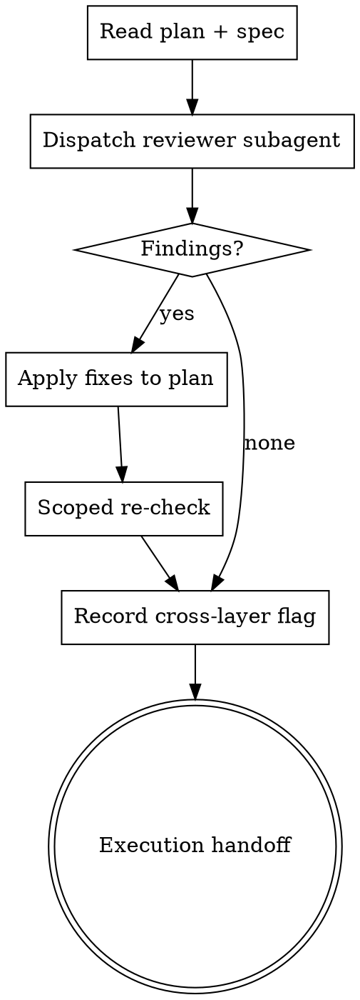

# Reviewing Plans

## Why this exists

Two reasons, and the second is the one that matters.

**The plan is the last artifact with a whole-codebase view.** Once execution starts,
every actor is deliberately narrowed. Implementers are told "don't restructure things
outside your task" and to escalate when work "involves restructuring existing code in ways
the plan didn't anticipate." Task reviewers are told "Do not crawl the broader codebase."
Those are correct safety properties and should not be relaxed.

But together they produce a specific, structural blind spot: **if the plan says "create a
new helper" when a 90%-suitable helper already exists two directories away, nothing
downstream can catch it.** The implementer is forbidden from going to look. The reviewer
is forbidden from crawling to where the original lives. The near-duplicate is not in the
diff, so it is invisible to every review that follows. It lands, and the codebase drifts.

The planner has the full view. This skill is the only gate that uses it.

**The plan also inherits every ambiguity in the spec.** A fresh reader with the spec and
the plan side by side catches requirements that silently evaporated between the two.

## When to Use

- Automatically: a plan was written to `docs/superpowers/plans/`, before execution handoff.
- Manually: `Skill(numatic:reviewing-plans)` on any plan, any time, including a re-run
  after edits.

**When NOT to use:**
- Reviewing the spec -> `numatic:reviewing-specs` (run that first; a spec flaw invalidates
  the plan wholesale, and fixing it after planning means rewriting the plan).
- Reviewing code -> `superpowers:requesting-code-review`.

## Process



### Step 1 - Gather the inputs

The reviewer needs three things: the plan, the spec it derives from, and the scenario list
carried forward from `numatic:reviewing-specs` if that ran. Without the spec the reviewer
can only check internal consistency, which the author already did.

### Step 2 - Dispatch one reviewer subagent

Use `reviewer-prompt.md`. Give the reviewer a capable model. Unlike the spec reviewer,
this one searches the codebase, and the reuse audit is genuine engineering judgment:
deciding whether an existing function can absorb a new case or whether forcing it would
be worse than a clean second function.

One subagent, one round, by default.

### Step 3 - Apply findings to the plan

Apply Critical and Important findings yourself in the main session. Plan edits are
targeted changes to a structured document, and the author has the context to make them
coherently.

Reuse findings deserve specific care. When the reviewer says "Task 3 creates
`formatDuration`, but `src/lib/time.ts:44` already has `humanizeDuration` covering 90% of
this," the fix is not a note in the plan saying "consider reusing." It is rewriting the
task so extending the existing function is what the task actually says to do, with the
new signature and the call sites to update spelled out. Vague encouragement will not
survive contact with an implementer who is forbidden from restructuring on their own
initiative.

Where you disagree with a finding, say so and leave the plan alone. Record why, in the
plan, so it does not get re-raised.

### Step 4 - Scoped re-check

Re-read only the tasks you edited, against only the findings you applied. Confirm the
edits are real changes to what the task instructs, not restatements. Confirm an extended
interface is reflected everywhere it appears in the plan - a changed signature usually
touches more than one task.

One round. If findings survive two, stop and put the disagreement to the human. A plan
question that resists two passes is a judgment call, not a defect.

### Step 5 - Record the cross-layer flag

Decide whether this plan is **cross-layer**: does the feature traverse more than one layer
that must agree on a contract (client and server, app and admin, schema and rules, service
and consumer, producer and subscriber)?

Write the verdict into the plan's Global Constraints, verbatim:

```
Cross-layer: yes | no
```

`yes` means `numatic:tracing-flows` runs before the final review. `no` means it is
skipped. Default to `yes` when uncertain - a skipped trace on a flow that needed one is a
production bug, while an unnecessary trace costs one dispatch.

### Step 6 - Hand off

Summarize, then proceed to the normal Superpowers execution handoff.

## What the reviewer checks

**1. Reuse audit (the primary lens).** For every file the plan creates and every function
or type it introduces, search the codebase for something that already does the job or most
of it. For each near-match, force an explicit decision: extend the existing code, or
create new. "Create new" is a legitimate answer, but it has to be argued, not defaulted
into.

Where the answer is extend, the plan must name the file, the current signature, the new
signature, and every call site that changes. That is what makes it executable by an
implementer who is otherwise forbidden from restructuring.

**2. Spec coverage.** Every requirement in the spec maps to at least one task. Every task
traces back to the spec. Requirements that vanished in translation, and tasks that
implement things nobody asked for, are equally findings.

**3. Scenario mapping.** Each scenario the spec covers should be implemented by some task
and verified by some test the plan names. A scenario the spec covers that no task
implements is a Critical finding: the gap survived the spec review and is about to survive
into code.

**4. Interface consistency.** A type or signature defined in one task and consumed in
another must match exactly. Names, shapes, nullability, error cases.

**5. Task feasibility and ordering.** Is each task independently implementable and
testable by a subagent that sees only its brief? Does any task depend on something a later
task creates?

## Red flags

| Thought | Reality |
|---|---|
| "The plan's self-review already passed" | That checked placeholders and type consistency. It did not search the codebase. |
| "The implementer will notice the existing utility" | They are instructed not to look and to escalate if they do. That instruction is correct; work with it. |
| "The final code review will catch duplication" | Only if the original is in the diff. It is not - that is the whole problem. |
| "Adding a param to the existing function is refactoring, out of scope" | Extending one function with its call sites named IS the scope. Drift is the alternative. |
| "Reuse is a Minor / nice-to-have" | Duplicated logic that drifts is the defect this plugin exists for. Judge it on the damage. |
| "This plan is small, skip the review" | Small plans create small helpers, which are exactly the ones that duplicate silently. |
| "I'll note 'consider reusing X' in the task" | An implementer forbidden from restructuring will not act on a suggestion. Rewrite the task. |

## Output

Report in chat:

- Verdict: ready to execute / needs fixes.
- **Reuse decisions**, each one line: `Task N: extend src/lib/time.ts:44 instead of new
  formatDuration` or `Task N: new function justified - existing one is async-only`.
- Other findings applied, grouped by severity.
- Findings not applied, with reasoning.
- The cross-layer verdict and what it means for the rest of the flow.

The plan file is the artifact. Do not write a separate review document.
