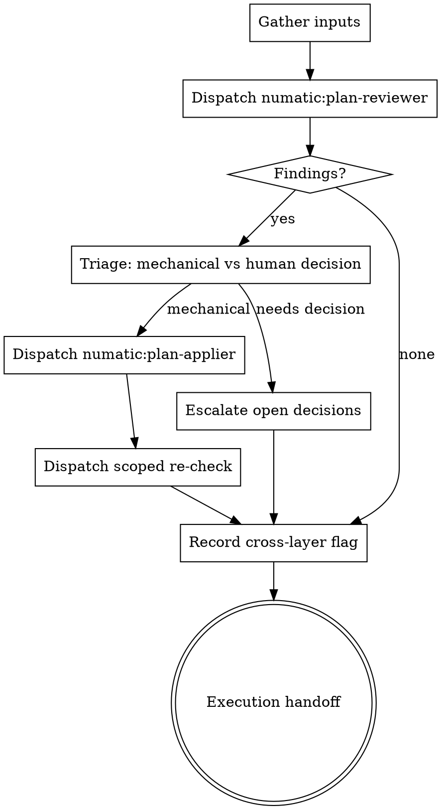

# Reviewing Plans

## Why this exists

Two reasons, and the second is the one that matters.

**The plan is the last artifact with a whole-codebase view.** Once execution starts,
every actor is deliberately narrowed. Implementers are told "don't restructure things
outside your task" and to escalate when work "involves restructuring existing code in ways
the plan didn't anticipate." Task reviewers are told "Do not crawl the broader codebase."
Those are correct safety properties and should not be relaxed.

But together they produce a specific, structural blind spot: **if the plan says "create a
new helper" when a 90%-suitable helper already exists two directories away, nothing
downstream can catch it.** The implementer is forbidden from going to look. The reviewer
is forbidden from crawling to where the original lives. The near-duplicate is not in the
diff, so it is invisible to every review that follows. It lands, and the codebase drifts.

The planner has the full view. This skill is the only gate that uses it.

**The plan also inherits every ambiguity in the spec.** A fresh reader with the spec and
the plan side by side catches requirements that silently evaporated between the two.

## When to Use

- Automatically: a plan was written to `docs/superpowers/plans/`, before execution handoff.
- Manually: `Skill(numatic:reviewing-plans)` on any plan, any time, including a re-run
  after edits.

**When NOT to use:**
- Reviewing the spec -> `numatic:reviewing-specs` (run that first; a spec flaw invalidates
  the plan wholesale, and fixing it after planning means rewriting the plan).
- Reviewing code -> `superpowers:requesting-code-review`.

## Three roles, three contexts

This skill mirrors the shape Superpowers uses for code: **review, apply, and re-check are
three separate fresh contexts, and you orchestrate them.** You are the controller. You do
not review the plan, you do not edit it, and you do not verify the edits.

Two reasons, and both are load-bearing here specifically:

**Quality.** A plan fix has an upstream source of truth - the spec - and the reuse findings
arrive as mechanical instructions (current signature, new signature, call sites, owning
task). Work with a source of truth can be handed to a stranger, and a stranger applies what
the finding says rather than what the author meant. The author's context, which watched the
plan being written, is exactly the bias the review exists to counter.

**Context economy.** Plan fixes are the largest edits in the whole workflow - rewriting
tasks from "create" to "extend" across a long document. Doing that inline loads the full
plan, the full findings, and every edit into the session that then has to run the entire
implementation. Compaction is this workflow's main failure mode, and this is the cheapest
place to avoid feeding it. You hold summaries; the subagents hold the documents.



### Step 1 - Gather the inputs

The reviewer needs three things:

1. **The plan** - absolute path.
2. **The spec it derives from** - absolute path. Without it the reviewer can only check
   internal consistency, which the author already did.
3. **The scenario list** - the numbered list under the spec's `## Scenarios` heading,
   written there by `numatic:reviewing-specs`. Read it from the spec file; do not rely on
   it being in this conversation, and do not re-derive a different list. If the spec has no
   `## Scenarios` section, say so explicitly in the dispatch and point the reviewer at
   `${CLAUDE_PLUGIN_ROOT}/references/scenario-taxonomy.md` to derive one.

### Step 2 - Dispatch the reviewer

Dispatch the **`numatic:plan-reviewer`** agent. Its system prompt carries the full audit
contract, the severity vocabulary, and the codebase-crawl licence, so your dispatch is just
the brief: see `dispatch-brief.md`.

Do not paste review instructions of your own. The agent definition is the contract; a
second set of instructions in the dispatch is how vocabulary and standards drift.

One reviewer, one round, by default.

### Step 3 - Triage the findings

Split what came back into two piles before dispatching anything:

**Mechanical** - the finding names the task, quotes what it says, and states what it must
say instead. A stranger could execute it. These go to the applier.

**Needs human decision** - the reviewer marked it as such, or the "fix" would require
choosing between product or architecture options the spec does not settle. These do not go
to an applier, which would invent an answer and write it into the plan with confidence.
They go to your human partner in Step 6.

Findings you believe are simply wrong stay with you: say so, with the reason, and do not
forward them.

### Step 4 - Dispatch the applier

Dispatch the **`numatic:plan-applier`** agent with the plan path, the spec path, and the
mechanical findings verbatim. Do not summarize the findings - the applier's fidelity to the
plan depends on receiving the full text, including the extend specifications.

Never apply the findings yourself. Controller edits skip the re-check and reload the whole
plan into the context that still has an implementation run ahead of it.

### Step 5 - Dispatch the scoped re-check

One fresh subagent, given only: the applied findings and the sections the applier reports it
edited. It answers three questions:

- Does each edit change what the task **instructs**, or was it reworded?
- Is a changed interface reflected everywhere it appears in the plan? A changed signature
  usually touches more than one task.
- Did the edits contradict anything the applier did not touch?

**One apply round and one re-check. There is no second wave.** Anything still open after
the re-check goes to the human alongside the Step 3 escalations. A plan question that
survives an apply and a re-check is a judgment call, not a defect.

### Step 6 - Record the cross-layer flag

Decide whether this plan is **cross-layer**: does the feature traverse more than one layer
that must agree on a contract (client and server, app and admin, schema and rules, service
and consumer, producer and subscriber)? The reviewer returns a verdict; you own the final
call.

Write it into the plan's **Global Constraints**, verbatim:

```
Cross-layer: yes | no
```

The plan file is where this lives because the consumers read it hours later, past
compaction. `yes` means `numatic:tracing-flows` runs before the final review. `no` means it
is skipped. Default to `yes` when uncertain - a skipped trace on a flow that needed one is a
production bug, while an unnecessary trace costs one dispatch.

### Step 7 - Hand off

Report (see Output), put any escalations in front of your human partner, then proceed to the
normal Superpowers execution handoff.

## What the reviewer checks

The full contract is in `agents/plan-reviewer.md`. In summary, in priority order:

**1. Reuse audit (the primary lens).** For every file the plan creates and every function
or type it introduces, search the codebase for something that already does the job or most
of it. Each is classified `DUPLICATE`, `NEAR-MATCH`, or `GENUINELY NEW`, and every
near-match gets an argued extend-or-create verdict. Where the answer is extend, the plan
must name the file, the current signature, the new signature, and every call site that
changes. That is what makes it executable by an implementer who is otherwise forbidden from
restructuring.

**2. Spec coverage.** Every requirement in the spec maps to at least one task. Every task
traces back to the spec. Requirements that vanished in translation, and tasks that
implement things nobody asked for, are equally findings.

**3. Scenario mapping.** Each scenario in the spec's `## Scenarios` list should be
implemented by some task and verified by some test the plan names. A scenario the spec
covers that no task implements is a Critical finding: the gap survived the spec review and
is about to survive into code.

**4. Interface consistency.** A type or signature defined in one task and consumed in
another must match exactly. Names, shapes, nullability, error cases.

**5. Task feasibility and ordering.** Is each task independently implementable and
testable by a subagent that sees only its brief? Does any task depend on something a later
task creates?

## Red flags

| Thought | Reality |
|---|---|
| "The plan's self-review already passed" | That was the author checking their own work minutes after writing it. It did not search the codebase. |
| "The implementer will notice the existing utility" | They are instructed not to look and to escalate if they do. That instruction is correct; work with it. |
| "The final code review will catch duplication" | Only if the original is in the diff. It is not - that is the whole problem. |
| "Adding a param to the existing function is refactoring, out of scope" | Extending one function with its call sites named IS the scope. Drift is the alternative. |
| "Reuse is a Minor / nice-to-have" | Duplicated logic that drifts is the defect this plugin exists for. Judge it on the damage. |
| "This plan is small, skip the review" | Small plans create small helpers, which are exactly the ones that duplicate silently. |
| "I'll note 'consider reusing X' in the task" | An implementer forbidden from restructuring will not act on a suggestion. Rewrite the task. |
| "I'll just apply these findings myself, dispatching is overhead" | Controller edits skip the re-check and load the whole plan into the context that still has to run the implementation. |
| "The scenario list is in our conversation already" | It is in the spec's `## Scenarios` section. Read it from the file - conversations get compacted. |
| "This finding needs a design call, I'll pick something sensible" | Then the plan records a decision nobody made. Escalate it. |

## Output

Report in chat:

- Verdict: ready to execute / needs fixes / needs rework.
- **Reuse decisions**, each one line: `Task N: extend src/lib/time.ts:44 instead of new
  formatDuration` or `Task N: new function justified - existing one is async-only`.
- Other findings applied, grouped by severity.
- Findings not applied, with reasoning.
- **Open for the human**: escalated decisions and anything the re-check left unresolved.
- The cross-layer verdict and what it means for the rest of the flow.

The plan file is the artifact. Do not write a separate review document.
