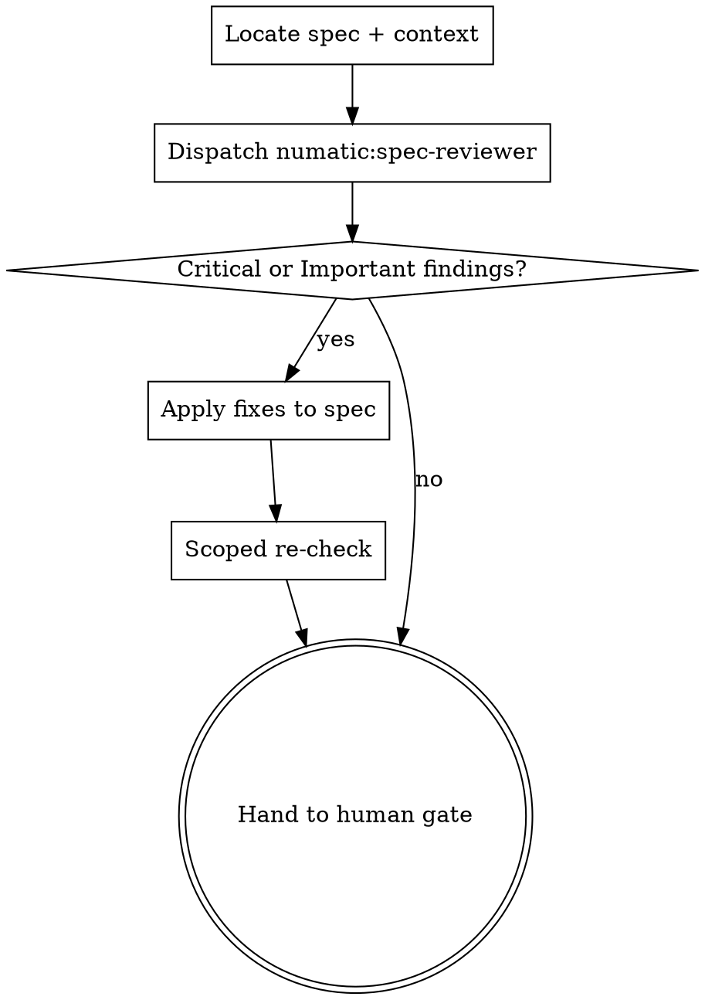

# Reviewing Specs

## Why this exists

Superpowers reviews code with a stranger and specs with the author. Its task reviewer gets
a fresh context and is told `Do Not Trust the Report`. Its spec self-review is a checklist
the author runs against their own work minutes after writing it.

That checklist is not empty - it covers placeholders, internal contradictions, scope, and
ambiguity - so the gap is not *which questions get asked*. The gap is **who asks them**.
An author checking their own spec for ambiguity reads every sentence with the intended
meaning already in mind, which is precisely the state in which a second reading is
invisible. And no checklist run from memory walks a scenario taxonomy.

So a spec with no `TBD` anywhere and perfect internal consistency can still be silent on
what happens when the record does not exist, and nothing downstream will catch it: the plan
inherits the silence, the tasks inherit the plan, and the task reviewer only checks the
task against the brief that the silence produced.

**A spec defect found here costs one edit. Found after planning, it invalidates the plan.
Found after implementation, it invalidates the code.** This is the cheapest gate in the
workflow, which is why it is never skipped for being small.

## When to Use

- Automatically: a spec was written to `docs/superpowers/specs/`, before the human gate.
- Manually: `Skill(numatic:reviewing-specs)` on any spec, any time, including a re-run
  after edits.

**When NOT to use:**
- Reviewing a plan -> `numatic:reviewing-plans`.
- Reviewing code -> `superpowers:requesting-code-review`.
- The spec has not been written yet -> `superpowers:brainstorming` first.

## Process

### Step 1 - Locate the spec and its context

Read the spec. Note the repo it belongs to and, if this is an existing codebase, what
subsystem it touches. The reviewer needs enough context to judge decomposition against
reality, not in the abstract.

### Step 2 - Dispatch the reviewer

Fresh context is the entire point. Do not review the spec yourself: you either wrote it or
watched it being written, and you cannot un-know the intent that the words failed to
capture.

Dispatch the **`numatic:spec-reviewer`** agent. Its system prompt carries the full review
contract and the severity vocabulary, so your dispatch is just the brief: see
`dispatch-brief.md`. Do not add review instructions of your own - a second source of
instruction is how standards drift between runs.

One reviewer, one round, by default. The spec is a short document and the lenses are
cheap.

### Step 3 - Apply findings yourself, in the main session

This is the one place in the flow where the author applies the fixes, and the asymmetry is
deliberate. `numatic:reviewing-plans` dispatches a separate fixer; this skill does not.

**A spec fix has no upstream source of truth.** When a plan review says "Task 3 duplicates
`humanizeDuration`," the finding carries its own answer and any competent stranger can
execute it. When a spec review says "the spec is silent on what happens when the record
does not exist," the answer is not in the spec, not in the codebase, and not in the
finding. It is in the brainstorming conversation and in your human partner's head. A fresh
fixer would not apply that fix; it would invent a design decision and write it in with
confidence, which is worse than author bias.

The independent check the split would buy already exists here: **the human gate is the very
next step**, and reviews the fixed spec.

So: apply Critical and Important findings to the spec directly. Minor findings are a
judgment call - apply the ones that are genuinely clarifying, and say which you skipped and
why.

Findings the reviewer marked `needs author decision` are not yours to settle silently
either. Answer them from what you know of the intent, and flag each one in the handoff so
the human sees the call that was made.

Where a finding is wrong, say so and leave the spec alone. The reviewer has no context
about prior decisions and will sometimes flag a deliberate choice. Record the reasoning in
the spec so the next reader does not re-raise it.

### Step 4 - Scoped re-check

Re-read only the sections you edited, against only the findings you applied. Confirm each
is genuinely resolved rather than reworded, and that the edits did not contradict
untouched sections.

This is a read, not another dispatch. It is capped at one round. If findings survive two
rounds, stop and put the disagreement in front of the human - a spec question that
resists two passes is a decision, not a defect.

### Step 5 - Hand to the human gate

Present a short summary, then the normal Superpowers spec gate. The human now reviews a
spec that has already survived an adversarial read.

> Spec written to `<path>` and reviewed by `numatic:reviewing-specs`.
> Applied: <N> findings. Open for your call: <anything you disagreed with or deferred>.
> Please review before I write the implementation plan.

## What the reviewer checks

The full contract is in `agents/spec-reviewer.md`. Four lenses, in priority order. The
scenario taxonomy lives in `${CLAUDE_PLUGIN_ROOT}/references/scenario-taxonomy.md`.

**1. Scenario coverage.** Walk the taxonomy. For each class, does the spec state what
should happen, or is it silent? Explicitly out of scope is a pass. Silence is a finding.
A class the change gives no site to manifest at - no new code path, writer, I/O or actor -
is marked N/A, but only with that property named and verified against the repo.

**2. Ambiguity.** Any requirement two competent engineers would implement differently.
The test is not "is this unclear" but "could this be read two ways" - a sentence can be
perfectly clear and still be ambiguous between two clear readings.

**3. Decomposition.** Is this one plan's worth of work? Are the units separable, with
interfaces stated rather than implied? A spec that describes three subsystems needs to
say how they meet.

**4. Testability.** For each requirement, could you write a test that fails when it is
violated? "Fast", "robust", and "user-friendly" are not testable. What would make them so?

## Red flags

| Thought | Reality |
|---|---|
| "The spec self-review already passed" | That was the author checking their own work. Fresh context and a taxonomy are what this adds. |
| "This spec is short, review is overkill" | Short specs hide gaps by omission. Length is not coverage. |
| "I'll review it myself, I know the context" | Knowing the context is the disqualification. Dispatch it. |
| "The human reviews it next anyway" | The human is reviewing prose for intent, not auditing scenario coverage against a taxonomy. |
| "Scenario X obviously doesn't apply here" | Then say that in the spec. Obvious-to-you is silence-to-the-planner. Only a reviewer N/A with a verified foreclosing property clears a class without a sentence in the spec. |
| "We can catch this in the plan review" | The plan review checks the plan against the spec. It inherits the spec's blind spots. |
| "I'll dispatch a fixer like the plan review does" | Spec fixes need intent the finding does not carry. A fresh fixer would invent the design decision. Apply them here, then the human gate checks you. |
| "I'll just answer this `needs author decision` and move on" | Answer it, but flag it. A design call made silently inside a review is how a spec acquires decisions nobody agreed to. |

## Output

Report in chat:

- One-line verdict: spec is ready / spec needs work.
- Findings applied, grouped by severity, each one line.
- Findings not applied, with reasoning.
- Anything escalated to the human.

Do not write a separate review artifact. The spec itself is the artifact, and the edits
are the record.

The one thing that must outlive this step is the **scenario list**. Write it into the spec
under a `## Scenarios` heading, as a numbered list, before handing off. Do not rely on
carrying it in the conversation: `numatic:reviewing-plans` runs after planning and
`numatic:tracing-flows` runs hours later, past compaction, and both are supposed to verify
*these* scenarios rather than derive a fresh set of their own. In the spec they survive;
in chat they do not.

**Where it goes:** append it at the end, after the spec's last existing section. The heading
is literally `## Scenarios` - five places downstream locate the list by that exact string, so
it carries no section number even in a spec whose other headings are numbered. Appending is
what keeps those two facts compatible: at the end, an unnumbered heading reads as a closing
appendix; wedged mid-document it breaks the spec's own numbering and forward-references
sections the reader has not reached yet.
