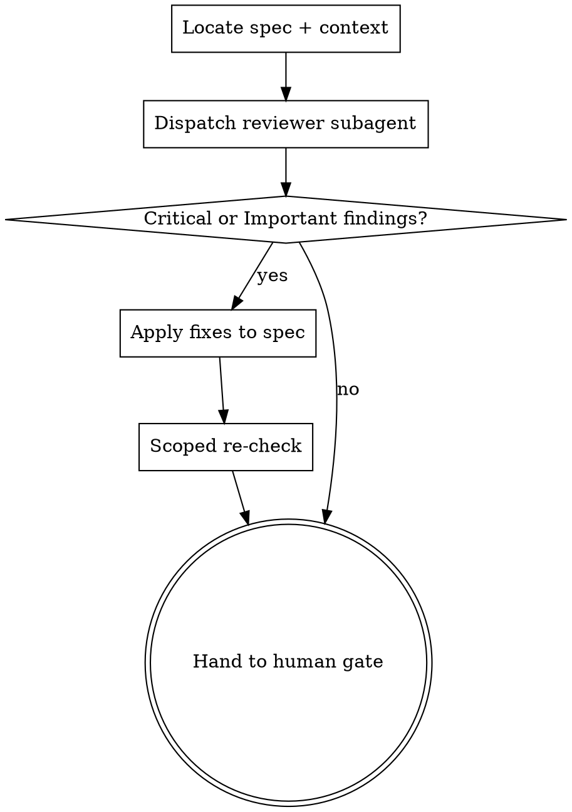

# Reviewing Specs

## Why this exists

Superpowers reviews code adversarially and specs cooperatively. The task reviewer is told
`Do Not Trust the Report` and treats the implementer's claims as unverified. The spec
self-review, by contrast, is the author reading their own work minutes after writing it,
checking for placeholders and contradictions.

Form is not the problem with specs. Content is. A spec with no `TBD` anywhere and perfect
internal consistency can still be silent on what happens when the record does not exist,
and nothing downstream will catch it: the plan inherits the silence, the tasks inherit the
plan, and the task reviewer only checks the task against the brief that the silence
produced.

**A spec defect found here costs one edit. Found after planning, it invalidates the plan.
Found after implementation, it invalidates the code.** This is the cheapest gate in the
workflow, which is why it is never skipped for being small.

## When to Use

- Automatically: a spec was written to `docs/superpowers/specs/`, before the human gate.
- Manually: `Skill(numatic:reviewing-specs)` on any spec, any time, including a re-run
  after edits.

**When NOT to use:**
- Reviewing a plan -> `numatic:reviewing-plans`.
- Reviewing code -> `superpowers:requesting-code-review`.
- The spec has not been written yet -> `superpowers:brainstorming` first.

## Process

### Step 1 - Locate the spec and its context

Read the spec. Note the repo it belongs to and, if this is an existing codebase, what
subsystem it touches. The reviewer needs enough context to judge decomposition against
reality, not in the abstract.

### Step 2 - Dispatch one reviewer subagent

Fresh context is the entire point. Do not review the spec yourself: you either wrote it or
watched it being written, and you cannot un-know the intent that the words failed to
capture. Use the prompt in `reviewer-prompt.md`.

One subagent, one round, by default. The spec is a short document and the lenses are
cheap.

### Step 3 - Apply findings

Apply Critical and Important findings to the spec yourself, in the main session. Unlike
code fixes, spec fixes are a handful of edits to one prose document and dispatching a
fixer costs more than it saves.

Minor findings are a judgment call. Apply the ones that are genuinely clarifying, and say
which you skipped and why.

Where a finding is wrong, say so and leave the spec alone. The reviewer has no context
about prior decisions and will sometimes flag a deliberate choice. Record the reasoning in
the spec so the next reader does not re-raise it.

### Step 4 - Scoped re-check

Re-read only the sections you edited, against only the findings you applied. Confirm each
is genuinely resolved rather than reworded, and that the edits did not contradict
untouched sections.

This is a read, not another dispatch. It is capped at one round. If findings survive two
rounds, stop and put the disagreement in front of the human - a spec question that
resists two passes is a decision, not a defect.

### Step 5 - Hand to the human gate

Present a short summary, then the normal Superpowers spec gate. The human now reviews a
spec that has already survived an adversarial read.

> Spec written to `<path>` and reviewed by `numatic:reviewing-specs`.
> Applied: <N> findings. Open for your call: <anything you disagreed with or deferred>.
> Please review before I write the implementation plan.

## What the reviewer checks

Four lenses, in priority order. The full scenario list lives in
`${CLAUDE_PLUGIN_ROOT}/references/scenario-taxonomy.md`.

**1. Scenario coverage.** Walk the taxonomy. For each class, does the spec state what
should happen, or is it silent? Explicitly out of scope is a pass. Silence is a finding.

**2. Ambiguity.** Any requirement two competent engineers would implement differently.
The test is not "is this unclear" but "could this be read two ways" - a sentence can be
perfectly clear and still be ambiguous between two clear readings.

**3. Decomposition.** Is this one plan's worth of work? Are the units separable, with
interfaces stated rather than implied? A spec that describes three subsystems needs to
say how they meet.

**4. Testability.** For each requirement, could you write a test that fails when it is
violated? "Fast", "robust", and "user-friendly" are not testable. What would make them so?

## Red flags

| Thought | Reality |
|---|---|
| "The spec self-review already passed" | That checked form. This checks content. Different failure modes. |
| "This spec is short, review is overkill" | Short specs hide gaps by omission. Length is not coverage. |
| "I'll review it myself, I know the context" | Knowing the context is the disqualification. Dispatch it. |
| "The human reviews it next anyway" | The human is reviewing prose for intent, not auditing scenario coverage against a taxonomy. |
| "Scenario X obviously doesn't apply here" | Then say that in the spec. Obvious-to-you is silence-to-the-planner. |
| "We can catch this in the plan review" | The plan review checks the plan against the spec. It inherits the spec's blind spots. |

## Output

Report in chat:

- One-line verdict: spec is ready / spec needs work.
- Findings applied, grouped by severity, each one line.
- Findings not applied, with reasoning.
- Anything escalated to the human.

Do not write a separate review artifact. The spec itself is the artifact, and the edits
are the record.

The one thing that must outlive this step is the **scenario list**. Write it into the spec
under a `## Scenarios` heading, as a numbered list, before handing off. Do not rely on
carrying it in the conversation: `numatic:reviewing-plans` runs after planning and
`numatic:tracing-flows` runs hours later, past compaction, and both are supposed to verify
*these* scenarios rather than derive a fresh set of their own. In the spec they survive;
in chat they do not.
